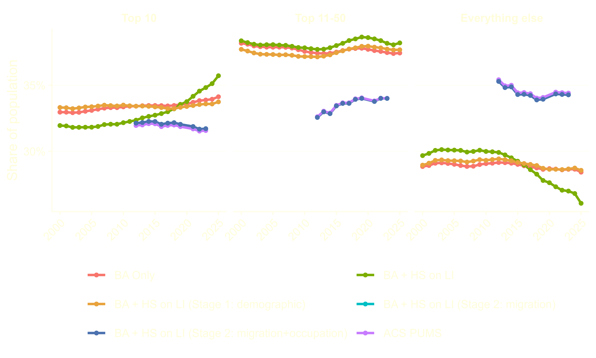
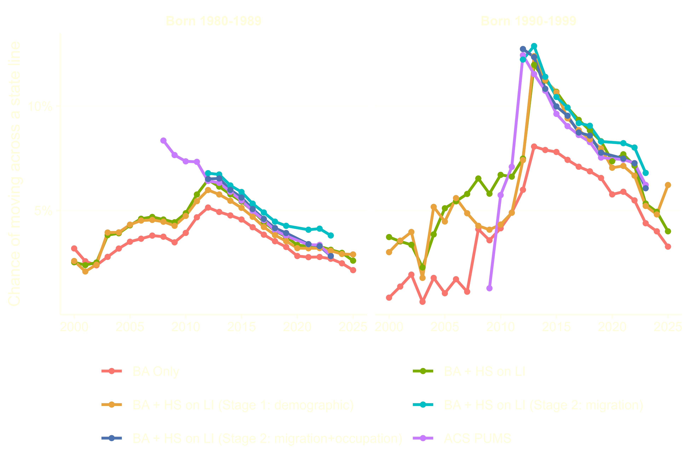
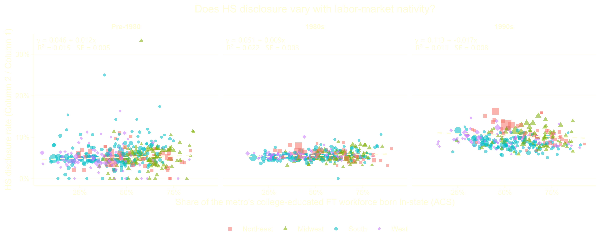
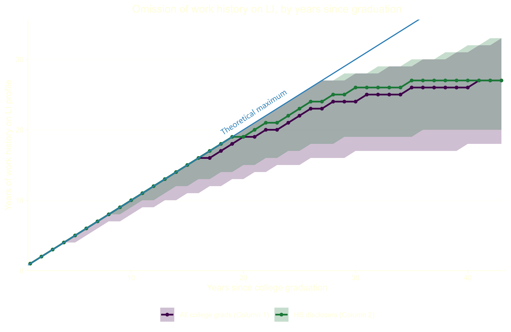
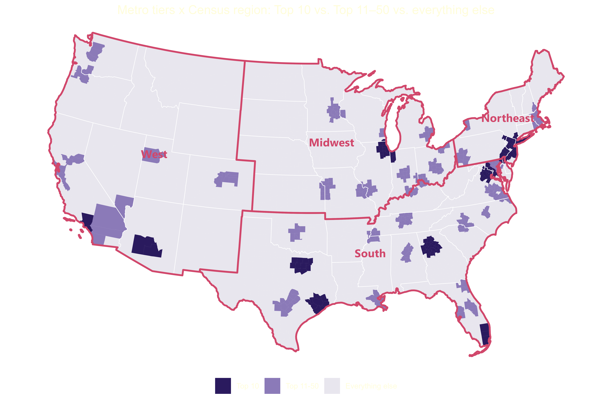
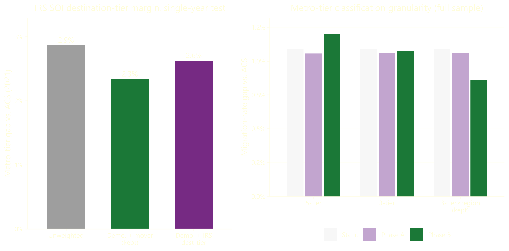

  <a class="site-name" href="index.html">Nicholas Martens</a>
  <nav class="top-nav">
    <a href="https://martensn.shinyapps.io/college_geography/" target="_blank" rel="noopener">live app</a>
    <a href="https://github.com/martensn/college_geography" target="_blank" rel="noopener">repo</a>
  </nav>

trade in training &mdash; methodology

## LinkedIn as a sample
Traditionally, social scientists studying social and demographic characteristics of the United States relied on surveys such as the American Community Survey (ACS) or Panel Study of Income Dynamics (PSID), which employ on sophisticated sampling techniques to construct representative samples of the American population.
Social media networks offer new possibilities for data collection, circumventing the lag associated with more traditional modes of data collection. For example, LinkedIn allows users to provide more detail on their educational attainment and employment than either the ACS. Additionally, the sheer scale of LinkedIn's user population means dwarfs the sample size of existing surveys.
However, selection bias poses a persistent threat to any empirical exercise relying on voluntary, user-created profiles. LinkedIn is no exception; Berry et al. (2024) show that profile creation is endogenous to industry, occupation, age, and geography. However, selection continues even after conditioning on profile creation: the completeness of a profile, particularly with respect to early-career work and educational experiences, varies widely across LinkedIn users. My analysis extracts a substantial amount of information from a LI profile; every additional requirement raises the specter of selection bias. In other words, the intensive margin (profile creation) and extensive margin (profile completeness) might distinctly exacerbate selection bias. I see a few distinct channels for selection bias to contaminate causal estimates of the migration response to labor demand shocks:

### Observable worker characteristics
The intertwined characteristics of college major, occupation, industry, and geography predict LinkedIn profile creation (Berry et al., 2024). College-educated workers concentrate in the industries over-represented among LinkedIn users. Furthermore, the over-represented industries cluster in large metropolitan area relative to other college-graduate-heavy occupations such as nursing and occupation, which scale with population. Given the spatial concentration of the industries over-represented on LI and the skew towards large metropolitan areas, the industry and occupation alone likely bias the migration rates upward relative to the full population of college graduates. The same spatial concentration likely reduces return migration, attenuating return migration to the origin labor market towards zero. Additionally, the table below shows how LinkedIn users skew white, male, and Northeastern, even relative to the ACS benchmark of similar college graduates. The race- and sex-based differences in take-up likely reflect occupational choice&ndash;the occupations and industries over-represented on LinkedIn tend to employ more male college graduates. The reweighting scheme described later attempts to correct for observable worker characteristics, with some success.

::: {.table-scroll}
|  Category  | BA Only | BA + HS on LI (unweighted) | BA + HS on LI (reweighted) | ACS PUMS |
| :--------: | :-----: | :---------------------------: | :---------------------------: | :------: |
|  **Race**  |         |                               |                               |          |
|   White    |  72.4   |             73.1              |             67.3              |   71.2   |
|   Black    |  11.5   |              9.4              |              8.7              |   8.3    |
|  Hispanic  |   7.8   |              7.6              |              9.5              |   8.2    |
|   Asian    |   5.7   |              6.1              |             10.7              |   9.9    |
|  Multiple  |   2.2   |              3.6              |              3.5              |   2.0    |
|   Native   |   0.5   |              0.2              |              0.2              |   0.3    |
|  **Sex**   |         |                               |                               |          |
|    Male    |  50.1   |             51.6              |             48.3              |   48.7   |
|   Female   |  49.9   |             48.4              |             51.7              |   51.3   |
| **Region** |         |                               |                               |          |
| Northeast  |  20.9   |             24.0              |             21.5              |   21.5   |
|  Midwest   |  21.6   |             21.8              |             20.8              |   20.9   |
|   South    |  34.2   |             31.9              |             34.0              |   34.2   |
|    West    |  23.4   |             22.2              |             23.6              |   23.4   |
:::

::: {#chart-metro-tier-share}

:::

1. **BA Only** &mdash; Revelio users satisfying all other sample requirements besides a valid high school
2. **BA + HS on LI** &mdash; Revelio users disclosing a high school (primary analysis sample)
3. **BA + HS on LI (reweighted)** &mdash; $w_{i,y}^{(2)}$ from &sect;5, the weight
   this memo argues for
4. **ACS PUMS** &mdash; benchmark constructed from ACS 5-year $[w_{i}^{(1)}]$ and 1-year $[w_{i,y}^{(1)}]$ PUMS

### Unobserved strength of social networks
For any user, the LinkedIn profile supplements existing social networks, augmenting social connections. Even after conditioning on bachelor's degree holders, the users creating and maintaining profiles might lack a pre-existing social network to facilitate social connections. Given the important role that social networks play in facilitating migration between labor markets (Koenen &amp; Johnston, 2024; Green, 2024), relying on the sample of profile creators with weaker social networks might bias migration rates towards zero. Similarly, profile creators who do leave their origin labor market might struggle to obtain opportunity and return at higher rates, biasing return migration rates upward. Indeed, [memo1_simplified_migration_rate_by_cohort_6line.png](#chart-migration-rate) shows that the unweighted college graduate population (red line) lags the ACS migration rate benchmark by approximately 1 p.p. for people born in the 1980s and 2-3 p.p. for 1990s, though the gaps shrink over time. The reduction in the gap might reflect the increasing ubiquity of LinkedIn creation among younger workers.

::: {#chart-migration-rate}

:::

### Profile completeness
Few (11 percent) of college graduates list a high school on their LinkedIn profile. In addition to dramatically reducing the sample size, requiring users to list a high school reduces the bias in [memo1_simplified_migration_rate_by_cohort_6line.png](#chart-migration-rate), pushing the cross-state migration rates closer to ACS benchmarks and worsens the existing bias towards large metropolitan areas in [memo1_full_sample_metro_tier_share_6line.png](#chart-metro-tier-share). While it widens the concentration of LI users across metro types, labor market size does not predict disclosure of a high school across any subset of birth cohorts. I suspect the increase in migration history simply reflects reduced censorship among users that disclose a high school. Relative to the general college graduate population, disclosers are 16 p.p. more likely to include a full employment record from college graduation to present on their profile. Even among older users, high school disclosers censor fewer years of early work history and cease censorship earlier. Requiring disclosure of a high school reduces missing location history, a form of measurement error that systematically reduces migration by omitting prior relocations.

::: {#chart-nativity-hs}

:::

::: {#chart-omission}

:::

## Reweighting
For all of the reasons listed above, the LinkedIn sample requires re-weighting. I attempt to limit potential unobserved selection by restricting to LinkedIn's core user population: workers holding bachelor's degrees born after 1980. I construct benchmarks from American Community Survey Public-Use Microdata Samples, restricting to employed workers with at least a bachelor's degree or higher ages 22 to 45 in 2025. The remainder of the re-weighting exercise focuses on younger college-educated workers only.

### Setup and notation
Before describing the reweighting methology, I will clarify the provenance and notation of different inputs.

#### Demographic Variables
Revelio Labs scrapes the data, constructing a person-level demographic characteristics file with sex, race, and ethnicity probabilities based on the user's name. I preserve the probabilities throughout the reweighting process, avoiding the injection of additional variation by taking a draw from the probabilities.

#### Geographic Variables
For every position a user lists on their profile, Revelio includes a geography field. I convert start and end dates into a year-standardized panel, reporting the Core-Based Statistical Area that a user worked on January 1 of the stated year. The standardization across time makes comparison of geography across individuals and time possible. For simplicity, I **assume** workers live in the CBSA where they work. Note that 13.5 percent of workers violated the assumption in the [2016-2020 5-Year ACS Commuting Flows](https://www.census.gov/data/tables/2020/demo/metro-micro/commuting-flows-2020.html) using 2023 OMB definitions of CBSAs.

### Time-invariant demographic weight
In the first stage of reweighting, I use iterative proportional fitting to construct a single weight for each user based on their race, sex, ethnicity, age, and migration in the past year. The first stage targets the under-45 college-educated labor force, matching two marginal proportions from the 2020-2024 5-Year ACS via iterative proportional fitting (IPF):
1. **Demographics**: age bin $\times$ race $\times$ sex $\times$ state of residence
2. **Recent mobility**: prior-year state of residence $\times$ whether the person moved
   states since prior year

IPF operates by rescaling sample weights to match a set of marginal distributions, iterating between the constraints until convergence. While a variety of packages implement IPF, I opted to manually construct a raking algorithm. Despite the millions of observations in the Revelio dataset, certain small states (ahem South Dakota) contain a small number of observations. Even if the cells represents a relatively small population, the sample weights still might explode in size due to sparse Revelio data. To avoid exploding weights, I clamp the ratio of ACS counts to Revelio observations at *every iteration*. At each iteration, alternate between the two margins. For margin $m$ with cells indexed by $k$, compute

$$r_k = \operatorname{clip}\!\left(\frac{N_k^{\text{ACS}}}{\sum_{i \in k} w_i^{(t)}},\ 0.05,\ 20\right)$$

and update $w_i^{(t+1)} = w_i^{(t)} \cdot r_{k(i)}$ for every $i$ in cell $k$. Iterate (alternating margins) until the largest single-row weight change falls below 1, or 10 iterations, whichever comes first. After convergence, each person's melted (person $\times$ race) rows are summed back to a single person-level weight, $w_i^{(1)}$.

### Time-varying migration weights
The first-stage of reweighting focuses on fixed characteristics of an individual such as race and sex, plus recent migration history. Yet the first stage ignores the flows of workers between labor markets prior to the present, even though the longitudinal structure of a resume constitutes a distinct advantage of the Revelio data over the ACS. The second stage of reweighting leverages the longitudinal structure of resume data to construct flows between locations throughout the sample period and compare the flows against ACS microdata.

#### Labor market groupings
Rather than compare flows between individual metropolitan areas, I construct 12 mutually exclusive and collectively exhaustive categories covering every county-equivalent in the United States. I form three groups of metropolitan areas based on their 2023 population ranking: the top ten, metros 11-50, and everything else (including micropolitan and non-CBSA counties). Each group constitutes approximately one-third of the college-educated labor force between 2010 and the present. Then I cross the size group with Census region (Northeast, Midwest, South, West), giving 12 cells total: Top 10 $\times$ Northeast, Top 10 $\times$ South, Everything Else $\times$ Midwest, and so on. [metro_tier_map.png](#chart-metro-tier-map) maps the groupings.
Domestic migrants differ across both metropolitan area size and region; simply grouping by metrpolitan area population rank obscures differences between domestic migrants to Dallas and New York, while a regional grouping ignores the difference between migration to Chicago and Kalamazoo.
I considered constructing the flows with IRS Survey of Income migration data, though it lacks any demographic characteristics. Instead, it measures aggregation migration flows for the entire country. As a result, it performs worse than the `MIGPUMA` to `PUMA` ACS flows. Similarly, I tried some distinct labor market groupings, none of which reduced error as effectively as the labor market groupings described above.

::: {#chart-metro-tier-map}

:::

::: {#chart-alt-specs}

:::

#### Calibration target
For a given calendar year $y$, define the **flow** of individual $i$: $$\big(o=\ell_{i,y-1},\ d=\ell_{i,y}\big)$$ where $\ell_{i,y}$ represent residence geography in year $y$ and $\ell_{i,y-1}$ the same for $y-1$. Within the ACS, I construct flows using two variables from PUMS: `MIGPUMA` for $\ell_{i,y-1}$ and `PUMA` for $\ell_{i,y}$ (Since the Census Bureau never produced a tract-to-PUMA crosswalk for 2000 PUMA boundaries, I focus on 2011-2023). Then I crosswalk the PUMA boundaries to the same labor market grouping via a
population-weighted geographic crosswalk. Approximately 7 percent of movers originate in a `MIGPUMA` that spans multiple labor market groupings, while 2.5 percent of destination PUMAs do. Armed with flows across labor market groupings by year, I define the calibration ratio:

$$r_{y,o,d} = \operatorname{clip}\!\left(\frac{\hat{p}^{\text{ACS}}_{y,o,d}}{\hat{p}^{\text{Revelio}}_{y,o,d}},\ 0.05,\ 20\right)$$

where $\hat{p}^{\text{ACS}}_{y,o,d}$ is ACS flow in year-origin-destination cell, and $\hat{p}^{\text{Revelio}}_{y,o,d}$ is the Revelio flow in the same cell. Note that ${\hat{p}^{\text{Revelio}}_{y,o,d}}$ excludes users who graduated college after $y$ and requires users to list a location in both $y$ and $y-1$. While a majority of users do list uninterrupted residential history, censorship of early work history is non-trivial within about a decade of graduating college (see [omission_distribution_two_series.png](#chart-omission)). Missing residential history (which arises from either gaps in work history, an early-career gap, or a late career one) means that I lose 17.4 percent of potential $\hat{p}^{Revelio}_{y,o,d}$ relative to a dataset with complete residential history for all users. The skew in the dataset towards workers who graduated in the last five years reduces the extent of the loss, since older workers drive much of the loss.

Even after reweighting the data to capture spatial sorting, the Revelio data misses the occupational sorting observed in the ACS. As a result, I include occupation (`OCCP`) as a second calibration margin. Revelio's job-level data provides an O\*NET-SOC code, which I crosswalk to the ACS occupational classification. Let $c_{i,y}$ denote the SOC major group of individual $i$'s position in year $y$. I define an occupation calibration ratio the same way as the geography one:

$$s_{y,c} = \operatorname{clip}\!\left(\frac{\hat{q}^{\text{ACS}}_{y,c}}{\hat{q}^{\text{Revelio}}_{y,c}},\ 0.05,\ 20\right)$$

where $c$ indexes the 23 SOC major groups and $\hat q_{y,c}$ is each side's occupation share among individuals present in year $y$.
With two margins instead of one, I employ the same capped-ratio raking logic in the first-stage demographic weight, applied here to two flow-type margins instead of two demographic ones. Starting from $w^{(2,0)}_{i,y} = w_i^{(1)}$, I alternate

$$w^{(2,k+1)}_{i,y} = w^{(2,k)}_{i,y}\cdot r^{(k)}_{y,\ o, d} \qquad w^{(2,k+2)}_{i,y} = w^{(2,k+1)}_{i,y}\cdot s^{(k)}_{y,\ \theta(\text{occ}_{i,y})}$$

recomputing each ratio from the current weights before applying it, until the weights converge.
The additional margin whittles the estimation sample a bit further: a person-year now needs a destination occupation and defined locations in both $y-1$ and $y$. Revelio's O\*NET-SOC code fails to resolve for a job title on roughly 10 percent of otherwise-valid rows, which I drop from the data.

## References

::: {.references}
Berry, A., Maloney, E. M., & Neumark, D. (2024). *The missing link? Using LinkedIn data to measure race, ethnic, and gender differences in employment outcomes at individual companies* (NBER Working Paper No. 32294). National Bureau of Economic Research. https://doi.org/10.3386/w32294

Green, A. (2024). *Networks and geographic mobility: Evidence from World War II Navy ships* [Unpublished manuscript]. Department of Economics, Princeton University.

Koenen, M., & Johnston, D. (2024). *Social ties and residential choice: Micro evidence and equilibrium implications* [Unpublished manuscript]. Department of Economics, Harvard University.
:::

